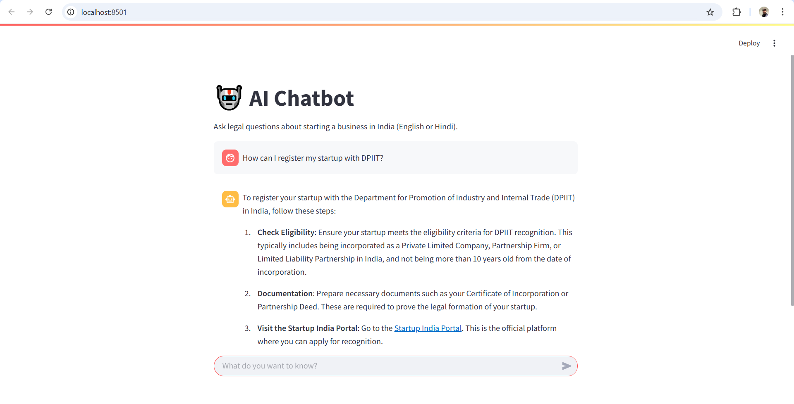

# 🧑‍⚖️ LegalEase – AI Legal Assistant for Indian Entrepreneurs

LegalEase is an AI-powered chatbot designed to simplify legal and tax compliance for Indian startup founders and small business owners. It uses Retrieval-Augmented Generation (RAG) with OpenAI GPT-4o and ChromaDB to deliver accurate, document-backed answers sourced from:



- [startupindia.gov.in](https://www.startupindia.gov.in/)
- [incometaxindia.gov.in](https://incometaxindia.gov.in/)

---

## 🎥 Demo

- 🔗 [Watch Demo Video](https://youtu.be/YOUR_VIDEO_LINK)
- 🌐 [Try the Live Chatbot](https://YOUR_STREAMLIT_APP_LINK)

---

## 🚀 Features

- ✅ Clear answers in English & Hindi
- ✅ Trained on real Indian government sources
- ✅ Uses RAG with ChromaDB for contextual accuracy
- ✅ Friendly, beginner-focused tone for new founders
- ✅ Fully open-source & locally hosted

---

## 🧠 Tech Stack

| Technology       | Role                                  |
|------------------|----------------------------------------|
| `OpenAI GPT-4o`  | LLM agent for answering questions      |
| `ChromaDB`       | Vector DB for storing document chunks  |
| `crawl4ai`       | Smart crawler to extract website text  |
| `Streamlit`      | Lightweight UI for the chatbot         |
| `LangChain`      | For PDF parsing and text chunking      |
| `Pydantic-AI`    | For creating typed tool-based agents   |

---

## 🧱 How It Works

1. Websites and legal PDFs are crawled or uploaded.
2. Content is chunked and embedded into ChromaDB using OpenAI embeddings.
3. User asks a question via the chatbot.
4. Relevant chunks are retrieved and passed to GPT-4o with system instructions.
5. GPT-4o generates accurate, beginner-friendly responses backed by documents.

---

## 🧑‍🤝‍🧑 Team

- **Jatin Khatri** – Backend engineer, RAG pipeline, agent integration
- **Hrishabh Singh** – UI & design, crawling, Streamlit interface

---

## ⚙️ Getting Started

### 1. **Clone the repository**

```bash
git clone https://github.com/JK-0001/legalease.git
cd legalease
```

### 2. **Install dependencies:**
   ```bash
   python -m venv venv
   venv\Scripts\activate # on Mac / Linux: source venv/bin/activate 
   pip install -r requirements.txt
   pip install langchain langchain-community langchain-openai
   playwright install
   ```

### 3. **Set up environment variables:**
   - create `.env` file
   - Update `.env` with your API keys and preferences:
     ```env
     OPENAI_API_KEY=your_openai_api_key
     MODEL_CHOICE=gpt-4.1-mini  # or your preferred OpenAI model
     ```